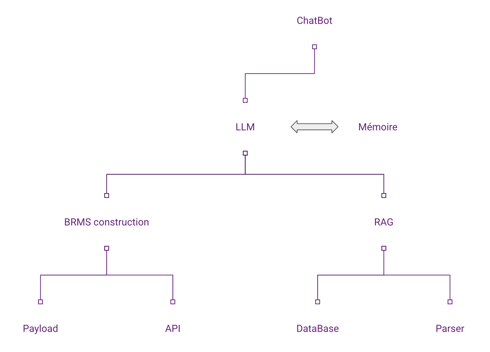

# Introduction

- LLMs (Large Language Models) have revolutionized natural language processing (NLP).
    - Understanding complex structures

- BRMS (Business Rule Management Systems) tools for managing complex business rules. 
    - Critical systems

## But
- LLMs are excellent at understanding and generating text, but lack the rigor to respect strict business rules (Hallucination).

	- Case in point: Air Canada refund problem caused by poorly integrated chatbot.

    [Airline held liable for its chatbot giving passenger bad advice - what this means for travellers - BBC](https://www.bbc.com/travel/article/20240222-air-canada-chatbot-misinformation-what-travellers-should-know)

- BRMS too limited for interaction 

## Benefits of BRMS-LLM integration

-  Increased compliance: LLM responses aligned with internal policies.

- Reduced errors: expert system-based decisions.

- Flexibility: combining the power of LLM with the rigor of BRMS. Complex reasoning

- Clarification of decision-making processes

# Architecture

# Demo

<video width="320" height="240" controls>
  <source src="assets/demoApp.mp4" type="video/mp4">
</video>

