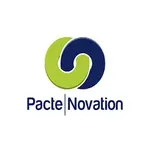
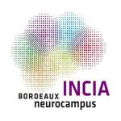

# Sébastien Tadiello

AI Engineer • Intelligent Systems • Scientific Computing • Field & Embedded AI

---

## About

Artificial Intelligence Engineer building robust and useful intelligent systems.

My work focuses on:
- Embedded & Edge AI
- Autonomous Systems
- Scientific & Exploration Technologies
- LLM and Memory Architectures

I am particularly interested in real-world systems operating in constrained environments.

---

## Current Interests

### Embedded Intelligence

Lightweight AI systems running on constrained hardware and edge devices.

### Autonomous Scientific Systems

Low-cost sensing, data collection and exploration-oriented technologies.

### AI Architectures

LLM systems, multimodal AI and long-term memory mechanisms.

---

## Technical Stack

| Domain | Technologies |
| :--- | :--- |
| Languages |      |
| AI & Data |      |
| Systems |    |
| Embedded & IoT |   |
| Scientific Writing |   |

---

## Directions

- Resilient AI systems
- Scientific exploration technologies
- Embedded & low-power intelligence
- Robotics & autonomous systems
- Open-source AI engineering

---

## Experience

I worked with and contributed to projects involving:

<table>
  <tr>
    <td align="center">
      
    </td>
    <td align="center">
      
    </td>
    <td align="center">
      
    </td>
    <td align="center">
      
    </td>
    <td align="center">
      
    </td>
  </tr>
</table>

---

## Links

- GitHub: https://github.com/stadiello
- Google Scholar: https://scholar.google.com/citations?user=EkjvvMIAAAAJ&hl=fr&oi=ao
<!-- - CV: https://github.com/stadiello/sebDtSci/blob/main/CV_tadiello.pdf -->

---

> "Build useful systems. Stay curious. Explore the real world."
